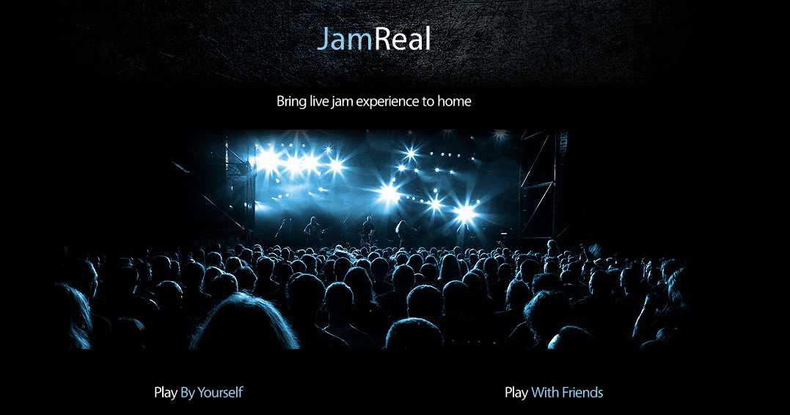

# JamReal

An independent fun project for a 4-day hackthon.

JamReal aims to let people have live jamming experience wherever they are. It comes with two modes: play by yourself and play with friends.

##Prerequisites##
 - Google Chrome 39 or above with #enable-web-midi flag activated
 - Some MIDI controller connected to your computer
s
##How To Use##

    git clone https://github.com/cindyliu686/JamReal
    cd JamReal/
    npm i && bower i
    npm start

Go to [http://localhost:3000/](http://localhost:3000/)

##Resource##
JamReal uses heavily several pre-built open source app and template as follow:  

[Webaudio Synthesizer](http://webmididemo.herokuapp.com/)

[Chat Example with peerJS](http://makeaharp.com/peer.htm)

[Making Music in the Browser](https://www.keithmcmillen.com/blog/making-music-in-the-browser-web-midi-api/)

[RockBand Template from TemplateMonster](https://www.templatemonster.com)

